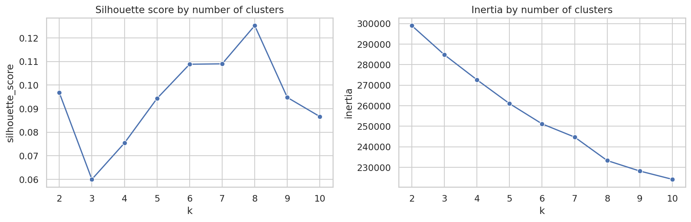
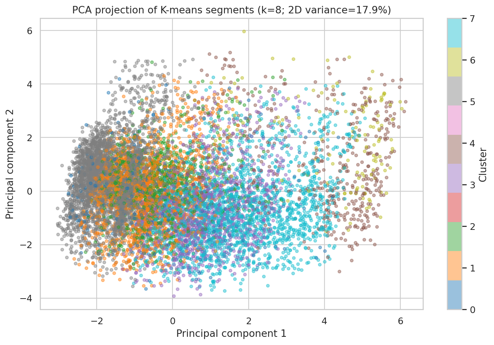
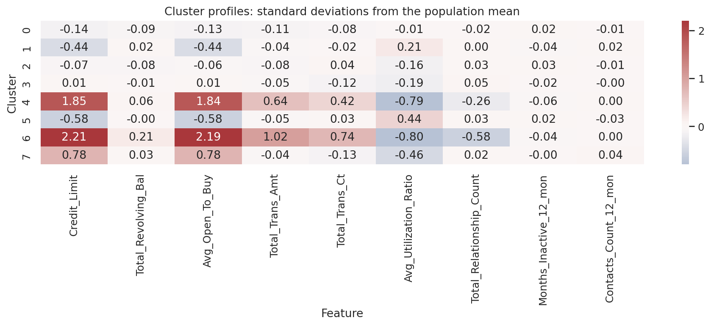

# Credit Card Customer Segmentation

This repository presents a reproducible K-means baseline for segmenting credit-card customers using behavioral, relationship, and account attributes.

## Business objective

The goal is to identify groups of customers with similar behavior so marketing, product, service, and risk teams can develop differentiated strategies. This is an unsupervised-learning project; it does not predict a target variable.

## Dataset

- Source: public BankChurners credit-card customer dataset
- Customers: 10,127
- Input features: 19
- Model features after one-hot encoding: 32
- Examples: credit limit, revolving balance, open-to-buy amount, transaction amount and count, utilization, relationship length, inactivity, and contact frequency
- Missing values in the supplied analysis file: 0
- Duplicate rows in the supplied analysis file: 0

The repository includes `Customer_Data.csv`, a cleaned analysis file with identifiers, the attrition label, and precomputed classifier-probability columns removed.

## Method

1. Inspect data quality and feature types.
2. One-hot encode categorical variables.
3. Standardize all model features because K-means is distance-based.
4. Fit candidate K-means models for `k=2` through `k=10` with an explicit random seed and `n_init`.
5. Compare candidates using a reproducible 3,000-record silhouette sample and full-data inertia.
6. Select the highest-silhouette candidate as a transparent baseline.
7. Use two-component PCA only for visualization; clustering uses the complete standardized feature set.
8. Profile cluster sizes and feature means.
9. Export the segmented records, model evaluation, and cluster profiles.

## Main finding

Using the documented environment and reproducible 3,000-record silhouette sample, the notebook selects **8 clusters** with a silhouette score of **0.1252**. The first two PCA components explain **17.87%** of total variance. The low silhouette score indicates substantial overlap between groups, so the clusters should be treated as an exploratory baseline—not as production-ready customer segments.

This limitation is important. Before business activation, the analysis should examine outliers and redundant variables, test alternative feature sets and clustering algorithms, assess stability across samples and time, and validate whether the segments are operationally meaningful.

## Potential business applications

After domain validation, behavioral segments could support:

- Cross-sell or rewards strategies for valuable, engaged customers
- Retention outreach for customers whose activity is declining
- Service interventions for customers with repeated contacts
- Risk review for customers with high utilization or revolving balances
- Controlled campaign testing to measure incremental conversion, retention, revenue, and profitability

The notebook does not claim that these interventions were deployed or that they produced measured financial impact.

## Visual outputs

### Candidate-model evaluation



### Two-dimensional PCA projection



### Numerical cluster profiles



## Repository contents

- `Credit_Card_Customer_Segmentation.ipynb` - complete analysis
- `Customer_Data.csv` - cleaned input data
- `Segmented_Customers.csv` - records with model-generated cluster labels
- `Cluster_Evaluation.csv` - silhouette and inertia results for candidate values of `k`
- `Cluster_Profiles.csv` - numerical-feature means by cluster
- `Cluster_Model_Selection.png` - silhouette and inertia diagnostics
- `Cluster_PCA_Projection.png` - two-dimensional projection for visualization
- `Cluster_Profile_Heatmap.png` - standardized numerical cluster profiles
- `requirements.txt` - Python dependencies

## Run locally

```bash
python -m pip install -r requirements.txt
jupyter notebook Credit_Card_Customer_Segmentation.ipynb
```

Run all cells from top to bottom. The final cell regenerates the three output CSV files.

## Tools

- Python
- pandas and NumPy
- scikit-learn
- Matplotlib and Seaborn

## Reproducibility

The random seed is fixed at 42, K-means uses an explicit `n_init=20`, and the silhouette sample uses the same fixed seed. Exact package versions are recorded in `requirements.txt`.
